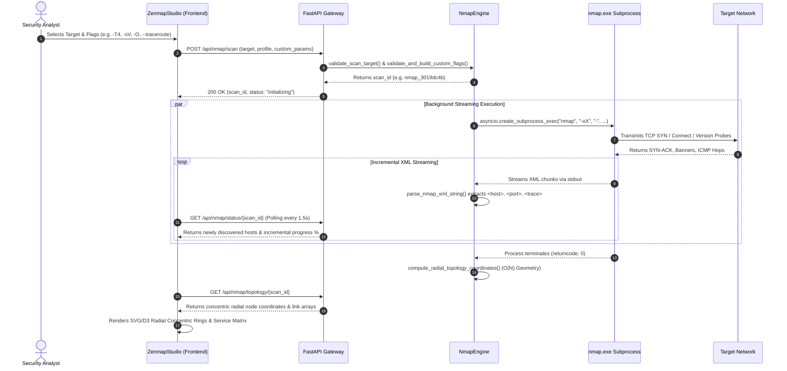
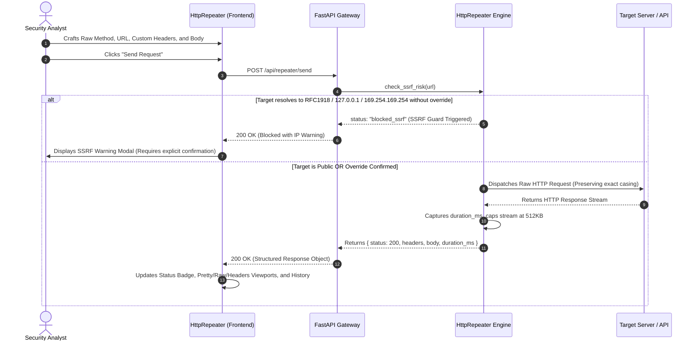
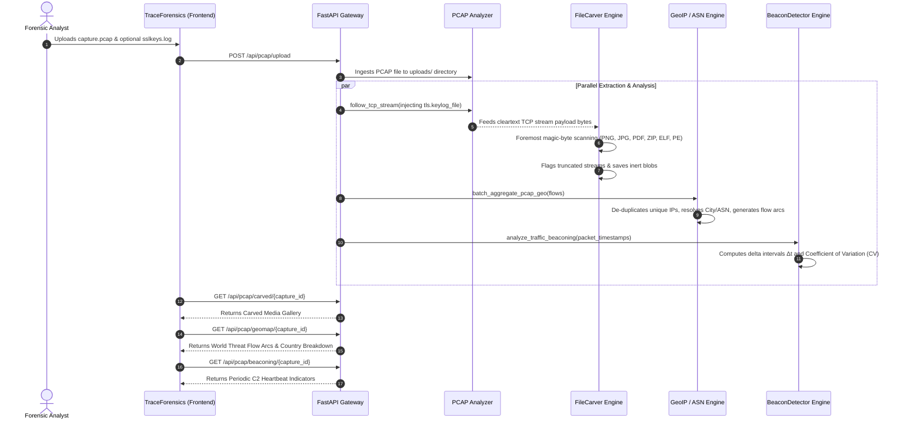

# 🏛️ Comprehensive Technical Architecture & Engineering Specification

> **VulnScan & Sentinel Forensic Security Suite** — A Unified Deep Packet Inspection (DPI) Forensic Engine, Automated Dynamic Application Security Testing (DAST) Platform, and Web-Based Zenmap Topology Studio.

---

## 1. 🌐 System Architectural Block Diagram

```mermaid
graph TB
    %% Styling
    classDef client fill:#0f172a,stroke:#38bdf8,stroke-width:2px,color:#fff;
    classDef gateway fill:#1e1b4b,stroke:#818cf8,stroke-width:2px,color:#fff;
    classDef engine fill:#14532d,stroke:#4ade80,stroke-width:2px,color:#fff;
    classDef storage fill:#3b0764,stroke:#c084fc,stroke-width:2px,color:#fff;
    classDef external fill:#451a03,stroke:#fb923c,stroke-width:2px,color:#fff;

    subgraph ClientTier["🖥️ Client Presentation Layer (React 19 + TypeScript + Vite)"]
        UI_Nav["TopBar & Shell Layout Manager"]
        UI_Zenmap["Web Zenmap Topology Studio<br/>• SVG/D3 Concentric Radial Graph<br/>• Service & OS Fingerprint Matrix<br/>• NSE Vulnerability Correlation<br/>• Typed Flag Custom Builder"]
        UI_Repeater["Interactive HTTP Repeater<br/>• Raw Byte/Header Crafter<br/>• SSRF Guard Warning Modal<br/>• Latency & Size Metrics<br/>• Pretty/Raw/Headers Inspector"]
        UI_Forensics["Packet Forensics Suite<br/>• TShark Stream Reassembler<br/>• TLS/QUIC Decryption Studio<br/>• Foremost Magic-Byte Carver<br/>• GeoIP & ASN Threat Map<br/>• C2 Jitter Beaconing Detector"]
        UI_Diff["Baseline Diff Scanner<br/>• 4-Way Category Tracker<br/>• Flakiness Window Classifier"]
        UI_Reports["Executive Reports & CVSS 3.1<br/>• Official FIRST.org Calculator<br/>• Async HTML/PDF Generator"]
    end

    subgraph GatewayTier["🚪 API Gateway & Security Boundary (FastAPI :8000 & Express :3001)"]
        GW_CORS["CORS Middleware (Allowed Origins & Methods)"]
        GW_WAF["WAF Middleware (SQLite Blocked IP Store)"]
        GW_SSRF["SSRF Guard (RFC1918 & Cloud Metadata Filter)"]
        GW_Limiter["TokenBucket Rate Limiter (Per-Host Asynchronous Limiting)"]
    end

    subgraph EngineTier["⚙️ Core Processing & Security Assessment Engines"]
        ENG_Nmap["Module 13: Zenmap / Nmap Engine<br/>• asyncio.create_subprocess_exec<br/>• Streaming XML iterparse<br/>• Fallback Socket Connect-Scanner"]
        ENG_SSL["Module 1: SSL/TLS Auditor<br/>• Cryptography X.509 Probes<br/>• A+ to F Grading Rubric<br/>• HSTS & Weak Cipher Matrix"]
        ENG_Orch["Module 2: Scanner Orchestrator<br/>• Stealth, Fast & Deep Profiles<br/>• Diagnostic Trace Logger"]
        ENG_Rep["Module 3: Raw HTTP Replayer<br/>• Low-Level Socket Pipeline<br/>• 512KB Stream Cap"]
        ENG_Carve["Module 4: Magic-Byte Carver<br/>• Foremost/Scalpel Headers<br/>• Truncation Detector<br/>• Inert Octet-Stream Storage"]
        ENG_Geo["Module 5: GeoIP & ASN Resolver<br/>• Local Resolution Cache<br/>• Precomputed Spatial Arcs"]
        ENG_Beacon["Module 6: C2 Beaconing Detector<br/>• Inter-Arrival Time Deltas<br/>• Coefficient of Variation (CV)"]
        ENG_QUIC["Module 7: QUIC/HTTP3 Decryptor<br/>• TShark Keylog Hook"]
        ENG_CVSS["Module 8: CVSS 3.1 Calculator<br/>• FIRST.org Vector Engine"]
        ENG_Diff["Module 9: Baseline Diff Engine<br/>• Stable Finding Fingerprinter"]
    end

    subgraph StorageTier["💾 Persistence & Storage Tier (SQLite WAL Mode)"]
        DB_Findings[("scan_findings<br/>• finding_hash [PK]<br/>• scan_id, target, module<br/>• severity, cvss_score, cwe<br/>• consecutive_count")]
        DB_Artifacts[("carved_artifacts<br/>• artifact_id [PK]<br/>• file_type, mime_type<br/>• file_size, md5_hash<br/>• is_truncated")]
        DB_Reports[("scan_reports<br/>• report_id [PK]<br/>• target, health_index<br/>• file_path, format")]
        DB_Events[("security_events<br/>• event_id, timestamp<br/>• source_ip, details")]
        DB_Alerts[("alerts<br/>• alert_id, rule_triggered<br/>• severity, status")]
    end

    subgraph TargetTier["🌐 Target Infrastructure & Intelligence Networks"]
        NET_Web["Target Web Applications & Microservices"]
        NET_Subnet["Target Subnets & Network Ports"]
        NET_PCAP["Live Capture Feeds & Uploaded PCAPs"]
        NET_Feeds["NVD & Vulners CVE Intelligence Feeds"]
    end

    %% Apply Classes
    class UI_Nav,UI_Zenmap,UI_Repeater,UI_Forensics,UI_Diff,UI_Reports client;
    class GW_CORS,GW_WAF,GW_SSRF,GW_Limiter gateway;
    class ENG_Nmap,ENG_SSL,ENG_Orch,ENG_Rep,ENG_Carve,ENG_Geo,ENG_Beacon,ENG_QUIC,ENG_CVSS,ENG_Diff engine;
    class DB_Findings,DB_Artifacts,DB_Reports,DB_Events,DB_Alerts storage;
    class NET_Web,NET_Subnet,NET_PCAP,NET_Feeds external;

    %% Linkages
    ClientTier -->|REST API / JSON & WebSockets| GatewayTier
    GatewayTier --> EngineTier
    EngineTier --> StorageTier
    EngineTier --> TargetTier

    %% Cross-Module Interactivity
    ENG_Nmap -.->|Discovered Open Ports| UI_Repeater
    ENG_Nmap -.->|Discovered TLS Endpoints| ENG_SSL
    ENG_Carve -.->|Extracted Blobs| DB_Artifacts
    ENG_CVSS -.->|Executive Assessments| DB_Reports
```



---

## 2. 🔄 End-to-End Sequence & Execution Workflows

### A. Web Zenmap & Nmap Asynchronous Discovery Workflow (Module 13)



---

### B. Interactive HTTP Repeater with SSRF Protection Workflow (Module 3)



---

### C. Packet Forensics, File Carving & TLS Decryption Pipeline (Modules 4, 5, 6, 7)



---

## 3. 🛡️ Security Architecture & Trust Boundaries

```
[ UNTRUSTED ZONE: User Browser / External Input ]
                      │
                      ▼ (Strict Input Sanitization: ^[a-zA-Z0-9.\-_/:]+$)
[ SECURITY GATEWAY: FastAPI WAF & SSRF Guard ]
                      │
                      ▼ (Zero-Shell Immutable Argument Array)
[ ISOLATED EXECUTION: asyncio.create_subprocess_exec (No shell=True) ]
                      │
                      ▼ (Memory Bounded Stream Parsing: 512KB Capped Buffers)
[ STORAGE & PERSISTENCE: SQLite WAL Mode with Safe Parameterized Queries ]
```

### 1. Zero-Shell Execution Policy
All backend subprocess invocations (Nmap, TShark, PyShark) construct immutable list structures:
```python
cmd = [nmap_path, "-oX", "-"] + validated_flags + [validated_target]
process = await asyncio.create_subprocess_exec(*cmd, stdout=PIPE, stderr=PIPE)
```
Shell interpreters (`shell=True`, `sh -c`, `cmd.exe /c`) are strictly prohibited, neutralizing shell injection, pipe hijacking, and command chaining vectors.

### 2. SSRF Protection & RFC1918 Network Isolation
Pre-flight DNS and socket resolution parses every target URL against dangerous CIDR blocks:
* `127.0.0.0/8` (Localhost loopback)
* `10.0.0.0/8`, `172.16.0.0/12`, `192.168.0.0/16` (Private RFC1918 subnets)
* `169.254.0.0/16` (Link-local autoconfiguration)
* `169.254.169.254` (Cloud Metadata services for AWS/GCP/Azure/DigitalOcean)

### 3. XML Entity & Billion Laughs Defense
All external XML files ingested via `/api/nmap/import-xml` or Nmap stdout streams disable external DTDs and entity expansion, immunizing the server from XML External Entity (XXE) vulnerabilities and quadratic blowup attacks.

### 4. Inert File Carving Storage
All files carved from network streams (PE executables, ELF binaries, PDF scripts) are saved as inert binary blobs and served strictly with:
```http
Content-Disposition: attachment; filename="<filename>"
Content-Type: application/octet-stream
X-Content-Type-Options: nosniff
```
This guarantees that downloaded forensic samples cannot execute within the client browser context.

---

## 4. 🗄️ Database Architecture & Data Dictionary

The platform utilizes a high-performance SQLite engine configured with **Write-Ahead Logging (WAL)** and in-memory temporary tables.

```
┌────────────────────────────────────────────────────────────────────────────────────────┐
│                                   DATABASE TABLES SCHEMA                               │
├───────────────────┬──────────────────────────────────┬─────────────────────────────────┤
│ Table Name        │ Primary Key / Indexes            │ Purpose                         │
├───────────────────┼──────────────────────────────────┼─────────────────────────────────┤
│ scan_findings     │ id [PK], finding_hash [IDX]      │ Normalized vulnerability records│
│ carved_artifacts  │ id [PK], capture_id [IDX]        │ Extracted media & binary files  │
│ scan_reports      │ report_id [PK], target [IDX]     │ Executive assessments & CVSS    │
│ security_events   │ id [PK], timestamp [IDX]         │ SIEM access & auth event logs   │
│ alerts            │ id [PK], status [IDX]            │ Rule-triggered detection alerts │
│ blocked_ips       │ ip_address [PK]                  │ WAF firewall dynamic blacklist  │
└───────────────────┴──────────────────────────────────┴─────────────────────────────────┘
```

---

## 5. 🔌 API Specification & Route Reference

### Web Zenmap Studio (`/api/nmap/*`)
* `GET /api/nmap/profiles`: Returns structured scan profiles (`quick_scan`, `ping_sweep`, `intense_scan`, `nse_vuln_audit`).
* `POST /api/nmap/scan`: Launches validated background scan.
* `GET /api/nmap/status/{scan_id}`: Returns live progress, discovered hosts, and raw output stream.
* `GET /api/nmap/topology/{scan_id}`: Precomputed server-side radial coordinate positions.
* `POST /api/nmap/import-xml`: Parses uploaded `.xml` / `.gnmap` scan logs safely.
* `POST /api/nmap/cancel/{scan_id}`: Cancels active subprocess.

### Interactive HTTP Repeater (`/api/repeater/*`)
* `POST /api/repeater/send`: Replays raw HTTP requests with SSRF guard and streaming cap.
* `POST /api/repeater/check-ssrf`: Pre-flight target IP safety check.

### SSL/TLS Security Auditor (`/api/ssl/*`)
* `POST /api/ssl/audit`: Evaluates TLS 1.0–1.3, weak ciphers, cert health, and HSTS.

### Baseline Diff Scanner (`/api/scan/*`)
* `POST /api/scan/diff`: Computes 4-way classification (`New`, `Resolved`, `Still-Open`, `Changed-Severity`).
* `GET /api/scan/findings`: Retrieves indexed finding records.

### Packet Forensics (`/api/pcap/*`)
* `GET /api/pcap/carved/{capture_id}`: Returns carved media and files.
* `GET /api/pcap/carved/download/{filename}`: Downloads inert carved file.
* `GET /api/pcap/geomap/{capture_id}`: Resolves batch-aggregated geographic threat flow arcs.
* `GET /api/pcap/beaconing/{capture_id}`: Calculates C2 interval deltas and jitter percentages.
* `POST /api/pcap/upload-keylog`: Ingests `SSLKEYLOGFILE` for TLS/QUIC decryption.

### Executive Reports & CVSS 3.1 (`/api/reports/*`, `/api/cvss/*`)
* `POST /api/reports/generate`: Generates executive HTML/PDF assessment asynchronously.
* `GET /api/reports/status/{report_id}`: Polls report build status.
* `GET /api/reports/download/{report_id}`: Downloads completed report.
* `POST /api/cvss/calculate`: Computes exact FIRST.org CVSS 3.1 base score.