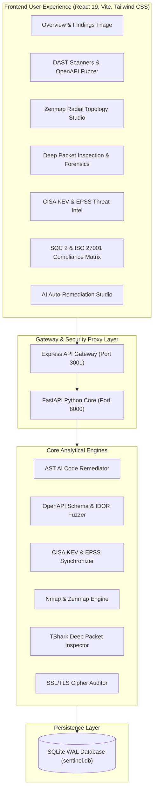

# 🏛️ Sentinel Forensic & Vulnerability Scanner Architecture

## 1. System Overview
Sentinel is an enterprise-grade DevSecOps, Dynamic Application Security Testing (DAST), Network Forensics, and Threat Intelligence platform designed to provide automated security scanning, AI-driven code remediation, and compliance governance.

---

## 2. Architecture Layers

---

## 3. Core Enterprise Engines

### A. AI Auto-Remediation Engine (`devsecops/remediator.py`)
- **AST Pattern Synthesis**: Synthesizes secure code replacements for SQL Injection (CWE-89), XSS (CWE-79), Path Traversal (CWE-22), Hardcoded Secrets (CWE-798), and Missing Headers (CWE-693).
- **Git Unified Diffing**: Generates standard `diff --git` patches with line-by-line before/after code comparisons.
- **1-Click Pull Request Dispatcher**: Dispatches pull requests directly to GitHub via the GitHub REST API (`POST /repos/{owner}/{repo}/pulls`).

### B. OpenAPI & Swagger Security Fuzzer (`api_fuzzer.py`)
- **Specification Ingestion**: Parses OpenAPI 3.0.x and Swagger 2.0 specs from remote URLs or raw JSON schemas.
- **Fuzzing Modules**:
  - **BOLA / IDOR**: Probes object identifiers (`{userId}`, `{id}`) across authorization boundaries.
  - **Mass Assignment**: Injects administrative and privilege-escalation fields (`isAdmin`, `role: "admin"`).
  - **SQLi Parameter Tampering**: Injects SQL test payloads into URL query parameters.
  - **Unauthenticated Route Disclosure**: Flags sensitive endpoints lacking required security definitions.

### C. CISA KEV & EPSS Threat Feeds (`cisa_epss_feeds.py`)
- **Catalog Ingestion**: Synchronizes with the official CISA Known Exploited Vulnerabilities catalog.
- **EPSS Scoring**: Calculates FIRST.org Exploit Prediction Scoring System probability percentiles.
- **Ransomware Intelligence**: Flags CVEs actively weaponized in known ransomware campaigns.

### D. SOC 2 & ISO 27001 Compliance Matrix (`ComplianceMatrix.tsx`)
- **Standard Mapping**:
  - **SOC 2 Type II**: CC6.1 (Logical Access), CC6.6 (Vulnerability Management), CC6.7 (Data Transmission Security), CC7.1 (Continuous Threat Monitoring), CC7.2 (Incident Remediation).
  - **ISO/IEC 27001:2022**: A.8.8 (Technical Vulnerabilities), A.8.20 (Network Security), A.8.24 (Cryptography & Secrets), A.5.15 (Access Control).
- **Automated Scorecard**: Generates real-time compliance readiness percentage scores and gap analysis.
- **1-Click Audit Export**: Exports compliance audit data in standard JSON format.

---

## 4. Security & Hardening Controls
1. **SSRF Guard**: Blocks RFC1918 private subnets and cloud metadata endpoints (`169.254.169.254`).
2. **Path Traversal Protection**: Uses `os.path.basename` and strict folder resolution on all file upload and capture handlers.
3. **Subprocess Sanitization**: Replaced all shell executions with typed argument arrays (`execFile` / `subprocess.Popen`) to prevent command injection.
4. **Zustand Storage Quotas**: Applied `partialize` to exclude high-volume network packet arrays from browser LocalStorage.
