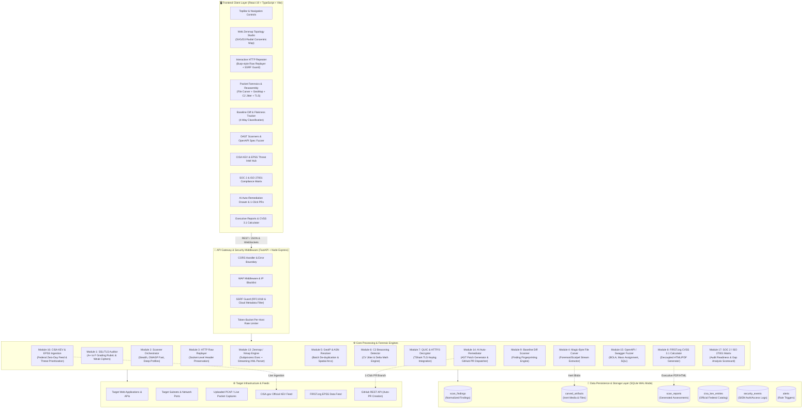

# 🛡️ VulnScan & Sentinel Forensic Security Suite

> **An Enterprise-Grade Cybersecurity Assessment Platform, Real-Time Deep Packet Inspection (DPI) Forensic Suite, DAST Vulnerability Scanner, AI Auto-Remediation Engine, CISA Threat Intel Feed, and SOC 2/ISO 27001 Compliance Matrix.**

[](https://github.com/nidhishv31-cpu/sentinel-jwt)
[](https://github.com/nidhishv31-cpu/VulnScan)
[](https://github.com/nidhishv31-cpu/Vulnerability-scanner)
[](#license)

---

## 🏛️ System Architecture Block Diagram



---

## 🚀 Complete Feature & Module Matrix

| Module | Title | Core Capability | Implementation |
| :--- | :--- | :--- | :--- |
| **Module 1** | **SSL/TLS Security & Cipher Auditor** | Deterministic A+ through F grading rubric, weak cipher detection (RC4, 3DES), cert validation, and HSTS evaluation. | [`backend/ssl_auditor.py`](sentinel-jwt/backend/ssl_auditor.py) |
| **Module 2** | **Scan Profiles & Rate Limiter** | Declarative profiles (`stealth`, `owasp_fast`, `deep_coverage`), per-host async-safe Token-Bucket rate limiter, and structured logging. | [`backend/scanner_orchestrator.py`](sentinel-jwt/backend/scanner_orchestrator.py) |
| **Module 3** | **Interactive HTTP Repeater** | Burp-style raw request crafter with exact header casing preservation, SSRF guard blocking RFC1918 / Cloud Metadata (`169.254.169.254`), and capped streaming response viewer. | [`backend/http_repeater.py`](sentinel-jwt/backend/http_repeater.py)<br/>[`src/pages/HttpRepeater.tsx`](src/pages/HttpRepeater.tsx) |
| **Module 4** | **Automated File Carving Engine** | Magic-byte pattern extraction (PNG, JPEG, GIF, PDF, ZIP, GZ, PE/ELF) from TCP stream payloads with truncation detection and safe inert storage. | [`backend/file_carver.py`](sentinel-jwt/backend/file_carver.py) |
| **Module 5** | **GeoIP & ASN Threat Map** | Cached local GeoIP/ASN resolution, batch de-duplication of packet IPs, and precomputed 60fps-capped threat flow arcs. | [`backend/geo_asn_map.py`](sentinel-jwt/backend/geo_asn_map.py) |
| **Module 6** | **C2 Beaconing & Jitter Detector** | Vectorized inter-arrival delta math, Coefficient of Variation ($CV < 0.25$) detection, and analyst verification status. | [`backend/beacon_detector.py`](sentinel-jwt/backend/beacon_detector.py) |
| **Module 7** | **QUIC & HTTP/3 Decryption** | TShark UDP/443 decryption using TLS session keylog injection with graceful best-effort fallback. | [`backend/pcap_analyzer.py`](sentinel-jwt/backend/pcap_analyzer.py) |
| **Module 8** | **Executive Reports & CVSS 3.1** | Official FIRST.org CVSS 3.1 base score formula engine and decoupled asynchronous HTML/PDF report renderer. | [`backend/report_generator.py`](sentinel-jwt/backend/report_generator.py) |
| **Module 9** | **Baseline Diff Scanner** | Deterministic finding fingerprinting with 4-way classification (`New`, `Resolved`, `Still-Open`, `Changed-Severity`). | [`backend/baseline_diff.py`](sentinel-jwt/backend/baseline_diff.py)<br/>[`src/pages/BaselineDiff.tsx`](src/pages/BaselineDiff.tsx) |
| **Module 13** | **Web Zenmap / Nmap Studio** | SVG/D3 radial concentric topology map, structured service & OS fingerprinting matrix, Vulners NSE correlation, and injection-safe typed flag builder. | [`backend/nmap_engine.py`](sentinel-jwt/backend/nmap_engine.py)<br/>[`src/pages/ZenmapStudio.tsx`](src/pages/ZenmapStudio.tsx) |
| **Module 14** | **AI Auto-Remediation & 1-Click PRs** | Automated AST code patch generator, side-by-side visual diff studio, attack vector explanation, and 1-click GitHub Pull Request dispatcher. | [`backend/devsecops/remediator.py`](sentinel-jwt/backend/devsecops/remediator.py)<br/>[`src/components/remediation/RemediationDrawer.tsx`](src/components/remediation/RemediationDrawer.tsx) |
| **Module 15** | **OpenAPI & Swagger Security Fuzzer** | OpenAPI 3.0 / Swagger 2.0 schema parser, automated BOLA/IDOR probes, Mass Assignment parameter injection, and broken authentication tests. | [`backend/api_fuzzer.py`](sentinel-jwt/backend/api_fuzzer.py)<br/>[`src/pages/DastHub.tsx`](src/pages/DastHub.tsx) |
| **Module 16** | **CISA KEV & EPSS Threat Feeds** | Real-time synchronization with CISA's official Known Exploited Vulnerabilities catalog, FIRST.org EPSS exploit risk percentiles, and ransomware filters. | [`backend/cisa_epss_feeds.py`](sentinel-jwt/backend/cisa_epss_feeds.py)<br/>[`src/pages/ThreatIntel.tsx`](src/pages/ThreatIntel.tsx) |
| **Module 17** | **SOC 2 & ISO 27001 Compliance Matrix** | Automated mapping of SAST/DAST findings to SOC 2 Type II trust criteria and ISO/IEC 27001:2022 controls with audit readiness scorecard and JSON audit report export. | [`src/pages/ComplianceMatrix.tsx`](src/pages/ComplianceMatrix.tsx) |

---

## 🛠️ Installation & Getting Started

### 1. Prerequisites
* **Node.js**: v18.x or v20.x+
* **Python**: v3.11+
* **Wireshark / TShark** (Optional, for live PCAP packet capture)
* **Nmap** (Optional, native socket connect-scan fallback activates if absent)

### 2. Backend Setup
```bash
cd sentinel-jwt/backend
python -m venv venv
# Windows:
venv\Scripts\activate
# Linux/macOS:
source venv/bin/activate

pip install -r requirements.txt
uvicorn main:app --reload --port 8000
```

### 3. Frontend Setup
```bash
cd scanner-app
npm install
npm run dev
```

Visit **`http://localhost:5173`** to access the complete application suite.

---

## 🧪 Automated Testing
```bash
# Run backend QA and enterprise test suite
python scratch/test_enterprise_suite.py

# Run frontend TypeScript typecheck and production build
cd scanner-app
npm run build
```

---

## 📄 License
MIT License. Created by Nidhish V.
