# 🛡️ VulnScan & Sentinel Forensic Security Suite

> **An Enterprise-Grade Cybersecurity Assessment Platform, Real-Time Deep Packet Inspection (DPI) Forensic Suite, DAST Vulnerability Scanner, and Web Zenmap Topology Studio.**

[](https://github.com/nidhishv31-cpu/sentinel-jwt)
[](https://github.com/nidhishv31-cpu/VulnScan)
[](https://vulnerability-scanner-forensics.netlify.app/)
[](#license)

---

## 🏛️ System Architecture Block Diagram

```mermaid
graph TB
    subgraph ClientLayer["🖥️ Frontend Client Layer (React 19 + TypeScript + Vite)"]
        UI_TopBar["TopBar & Navigation Controls"]
        UI_Zenmap["Web Zenmap Topology Studio<br/>(SVG/D3 Radial Concentric Map)"]
        UI_Repeater["Interactive HTTP Repeater<br/>(Burp-style Raw Replayer + SSRF Guard)"]
        UI_Forensics["Packet Forensics & Reassembly<br/>(File Carver + GeoMap + C2 Jitter + TLS)"]
        UI_Diff["Baseline Diff & Flakiness Tracker<br/>(4-Way Classification)"]
        UI_DAST["DAST Scanners & Recon Matrix"]
        UI_Reports["Executive Reports & CVSS 3.1 Calculator"]
    end

    subgraph GatewayLayer["🚪 API Gateway & Security Middleware (FastAPI + Node Express)"]
        GW_CORS["CORS Handler & Error Boundary"]
        GW_WAF["WAF Middleware & IP Blacklist"]
        GW_SSRF["SSRF Guard (RFC1918 & Cloud Metadata Filter)"]
        GW_RateLimit["Token-Bucket Per-Host Rate Limiter"]
    end

    subgraph CoreEngines["⚙️ Core Processing & Forensic Engines"]
        ENG_Nmap["Module 13: Zenmap / Nmap Engine<br/>(Subprocess Exec + Streaming XML Parser)"]
        ENG_SSL["Module 1: SSL/TLS Auditor<br/>(A+ to F Grading Rubric & Weak Ciphers)"]
        ENG_Orch["Module 2: Scanner Orchestrator<br/>(Stealth, OWASP Fast, Deep Profiles)"]
        ENG_Rep["Module 3: HTTP Raw Replayer<br/>(Socket-Level Header Preservation)"]
        ENG_Carve["Module 4: Magic-Byte File Carver<br/>(Foremost/Scalpel Stream Extractor)"]
        ENG_Geo["Module 5: GeoIP & ASN Resolver<br/>(Batch De-duplication & Spatial Arcs)"]
        ENG_Beacon["Module 6: C2 Beaconing Detector<br/>(CV Jitter & Delta Math Engine)"]
        ENG_QUIC["Module 7: QUIC & HTTP/3 Decryptor<br/>(TShark TLS Keylog Integration)"]
        ENG_CVSS["Module 8: FIRST.org CVSS 3.1 Calculator<br/>(Decoupled HTML/PDF Generator)"]
        ENG_Diff["Module 9: Baseline Diff Scanner<br/>(Finding Fingerprinting Engine)"]
    end

    subgraph StorageLayer["💾 Data Persistence & Storage Layer (SQLite WAL Mode)"]
        DB_Findings[("scan_findings<br/>(Normalized Findings)")]
        DB_Artifacts[("carved_artifacts<br/>(Inert Media & Files)")]
        DB_Reports[("scan_reports<br/>(Generated Assessments)")]
        DB_Events[("security_events<br/>(SIEM Auth/Access Logs)")]
        DB_Alerts[("alerts<br/>(Rule Triggers)")]
    end

    subgraph ExternalTargets["🌐 Target Infrastructure & Feeds"]
        Target_Web["Target Web Applications & APIs"]
        Target_Net["Target Subnets & Network Ports"]
        Target_PCAP["Uploaded PCAP / Live Packet Captures"]
        Feed_CVE["NVD & Vulners CVE Feeds"]
    end

    %% Flow Connections
    ClientLayer -->|REST / JSON & WebSockets| GatewayLayer
    GatewayLayer --> CoreEngines
    CoreEngines --> StorageLayer
    CoreEngines --> ExternalTargets
    ENG_Nmap -.->|Discovered Open Ports| UI_Repeater
    ENG_Nmap -.->|TLS Endpoints| ENG_SSL
    ENG_Carve -.->|Inert Blobs| DB_Artifacts
    ENG_CVSS -.->|Executive PDF/HTML| DB_Reports
```



---

## 🚀 Complete Feature & Module Matrix

| Module | Title | Core Capability | Implementation |
| :--- | :--- | :--- | :--- |
| **Module 1** | **SSL/TLS Security & Cipher Auditor** | Deterministic A+ through F grading rubric, weak cipher detection (RC4, 3DES), cert validation, and HSTS evaluation. | [`backend/ssl_auditor.py`](sentinel-jwt/backend/ssl_auditor.py) |
| **Module 2** | **Scan Profiles & Rate Limiter** | Declarative profiles (`stealth`, `owasp_fast`, `deep_coverage`), per-host async-safe Token-Bucket rate limiter, and structured logging. | [`backend/scanner_orchestrator.py`](sentinel-jwt/backend/scanner_orchestrator.py) |
| **Module 3** | **Interactive HTTP Repeater** | Burp-style raw request crafter with exact header casing preservation, SSRF guard blocking RFC1918 / Cloud Metadata (`169.254.169.254`), and capped streaming response viewer. | [`backend/http_repeater.py`](sentinel-jwt/backend/http_repeater.py)<br/>[`src/pages/HttpRepeater.tsx`](src/pages/HttpRepeater.tsx) |
| **Module 4** | **Automated File Carving Engine** | Magic-byte pattern extraction (PNG, JPEG, GIF, PDF, ZIP, GZ, PE/ELF) from TCP stream payloads with truncation detection and safe inert storage. | [`backend/file_carver.py`](sentinel-jwt/backend/file_carver.py) |
| **Module 5** | **GeoIP & ASN Threat Map** | Cached local GeoIP/ASN resolution, batch de-duplication of packet IPs, and precomputed 60fps-capped threat flow arcs. | [`backend/geo_asn_map.py`](sentinel-jwt/backend/geo_asn_map.py) |
| **Module 6** | **C2 Beaconing & Jitter Detector** | Vectorized inter-arrival delta math, Coefficient of Variation ($CV < 0.25$) detection, and analyst verification status. | [`backend/beacon_detector.py`](sentinel-jwt/backend/beacon_detector.py) |
| **Module 7** | **QUIC & HTTP/3 Decryption** | TShark UDP/443 decryption using TLS session keylog injection with graceful best-effort fallback. | [`backend/pcap_analyzer.py`](sentinel-jwt/backend/pcap_analyzer.py) |
| **Module 8** | **Executive Reports & CVSS 3.1** | Official FIRST.org CVSS 3.1 base score formula engine and decoupled asynchronous HTML/PDF report renderer. | [`backend/report_generator.py`](sentinel-jwt/backend/report_generator.py) |
| **Module 9** | **Baseline Diff Scanner** | Deterministic finding fingerprinting with 4-way classification (`New`, `Resolved`, `Still-Open`, `Changed-Severity`). | [`backend/baseline_diff.py`](sentinel-jwt/backend/baseline_diff.py)<br/>[`src/pages/BaselineDiff.tsx`](src/pages/BaselineDiff.tsx) |
| **Module 13** | **Web Zenmap / Nmap Studio** | SVG/D3 radial concentric topology map, structured service & OS fingerprinting matrix, Vulners NSE correlation, and injection-safe typed flag builder. | [`backend/nmap_engine.py`](sentinel-jwt/backend/nmap_engine.py)<br/>[`src/pages/ZenmapStudio.tsx`](src/pages/ZenmapStudio.tsx) |

---

## 🛠️ Installation & Getting Started

### 1. Prerequisites
* **Node.js**: v18.x or v20.x+
* **Python**: v3.11+
* **Wireshark / TShark** (Optional, for live PCAP packet capture)
* **Nmap** (Optional, native socket connect-scan fallback activates if absent)

### 2. Backend Setup
```bash
cd sentinel-jwt
python -m pip install -r requirements.txt
python -m pip install cryptography pytest-asyncio pyshark pyjwt requests
```

### 3. Frontend Setup
```bash
cd scanner-app
npm install
npm run build
```

### 4. Running the Platform Locally
```bash
# Start backend server daemon (FastAPI on :8000, Express on :3001)
node backend/server.js

# Start frontend development server
npm run dev
```

Visit **http://localhost:5173/** in your web browser.

---

## 🧪 Running the Automated Test Suite

The platform includes a comprehensive 31-test pytest suite covering unit logic, mathematical formulas, metacharacter injection blocking, XML streaming, and process life-cycles:

```bash
cd sentinel-jwt
python -m pytest backend/ -v
```

### Verified Test Summary (100% Pass Rate):
* `test_advanced_modules.py`: 18 passing tests (CVSS 3.1, SSL rubric, SSRF guard, File carving, GeoIP, Beaconing, Diffing).
* `test_nmap_module.py`: 8 passing tests (Target validation, injection rejection, custom flag builder, XML streaming, radial topology, socket fallback).
* `test_backend.py`: 5 passing tests (JWT analyzer, log parser, SIEM rules, Wireshark engine, diagnostics).

---

## 🌐 Live Production Deployment
* **Live Netlify Production Site**: **[https://vulnerability-scanner-forensics.netlify.app/](https://vulnerability-scanner-forensics.netlify.app/)**
* **Frontend GitHub Repo**: **[https://github.com/nidhishv31-cpu/VulnScan.git](https://github.com/nidhishv31-cpu/VulnScan.git)**
* **Backend GitHub Repo**: **[https://github.com/nidhishv31-cpu/sentinel-jwt.git](https://github.com/nidhishv31-cpu/sentinel-jwt.git)**